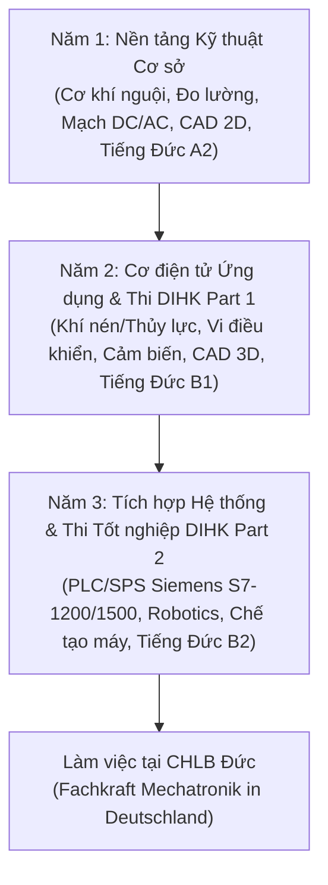

# ⚙️ Mechatronik Lernreise (Hành Trình Cơ Điện Tử)

[](https://www.dihk.de)
[](http://lilama2.edu.vn)
[](https://www.autodesk.com)
[](https://www.python.org)
[](https://apple.com)

> **„Theorie ohne Praxis ist nutzlos, Praxis ohne Theorie ist blind.“**  
> *(Lý thuyết không có thực hành là vô ích, thực hành không có lý thuyết là mù quáng.)*

---

## 👤 1. Về Tác Giả & Định Hướng Đào Tạo (Über mich)

* **Họ và tên:** Trần Gia Phát (Ethan)
* **Chuyên ngành:** Kỹ thuật Cơ điện tử (*Mechatronik*)
* **Trường đào tạo:** Trường Cao Đẳng Công Nghệ Quốc Tế Lilama 2 (*Lilama 2 International Technology College*)
* **Mã lớp:** `26.02.37.03` — Khóa 20 (Niên khóa 2026 – 2029)
* **Tiêu chuẩn kiểm định:** Đào tạo theo mô hình Đào tạo Kép của CHLB Đức do Phòng Công nghiệp & Thương mại Đức (**DIHK / AHK**) đánh giá và cấp chứng chỉ quốc tế.
* **Mục tiêu 3 - 5 năm:**
  1. Hoàn thành xuất sắc kỳ thi tốt nghiệp chuẩn DIHK Part 1 & Part 2.
  2. Đạt trình độ tiếng Đức B1/B2 chuyên ngành kỹ thuật (*Fachdeutsch*).
  3. Sang CHLB Đức làm việc trực tiếp tại các tập đoàn chế tạo máy, tự động hóa công nghiệp và robotics.

---

## 🧭 2. Triết Lý Kỹ Thuật (Ingenieur-Philosophie)

1. **Bản chất nguyên lý đầu tiên (First Principles):** Mọi hiện tượng kỹ thuật đều bắt nguồn từ các định luật vật lý và số học cơ sở. Không học vẹt, luôn tìm hiểu bản chất *Tại sao* trước khi áp dụng công thức.
2. **Kỷ luật tiêu chuẩn công nghiệp (DIN / EN / ISO):** Mọi bản vẽ kỹ thuật, quy ước dung sai, ký hiệu linh kiện điện - cơ khí đều tuân thủ nghiêm ngặt tiêu chuẩn quốc tế.
3. **Song ngữ kỹ thuật (*Fachbegriffe*):** Đối chiếu song song thuật ngữ tiếng Anh quốc tế (*Datasheet, CAD, Ohm's law, Flip-Flop*) và tiếng Đức chuyên ngành (*Widerstand, Kondensator, Lastenhaken, Schaltung, Steuerungstechnik*).

---

## 📚 3. Cấu Trúc Module Môn Học HK1 (Module & Fächer)

| Mã số | Môn học (*Fach*) | Thuật ngữ tiếng Đức | Nội dung cốt lõi & Tiêu chuẩn |
|:---:|:---|:---|:---|
| **M01** | **Kỹ thuật gia công cơ khí cơ bản** | *Grundlagen mechanischer Bearbeitung* | Đo kiểm dung sai (thước cặp, panme, thước tóc *Haarlineal*), cưa, dũa, lấy dấu, gia công nguội chính xác. |
| **M02** | **Cơ sở kỹ thuật điện** | *Grundlagen der Elektrotechnik* | Định luật Ohm, phân tích mạch DC/AC, định luật Kirchhoff, công suất điện, nguyên lý đo lường V-A-Ω (Giáo trình ELABO Đức). |
| **M03** | **Điện tử cơ bản** | *Grundlagen der Elektronik* | Vật liệu dẫn điện & bán dẫn (*Halbleiter*), đặc tuyến Diode, Transistor BJT/MOSFET, mạch chỉnh lưu & nguồn ổn áp. |
| **M04** | **Giao tiếp kỹ thuật / Vẽ CAD** | *Technisches Zeichnen & CAD* | Tiêu chuẩn đường nét DIN ISO 128, hình chiếu trực giao, mặt cắt, dung sai hình học, thiết kế CAD 2D/3D. |
| **M05** | **Kỹ thuật số** | *Digitaltechnik* | Đại số Boole, cổng logic cơ bản (AND/OR/NOT/NAND), bảng chân trị (*Wahrheitstabelle*), mạch tổ hợp & mạch tuần tự. |
| **M06** | **Nhập môn Cơ điện tử** | *Einführung in die Mechatronik* | Cấu trúc hệ thống Cơ điện tử: Cảm biến (*Sensoren*), Bộ xử lý (*Steuerung*), Cơ cấu chấp hành (*Aktoren*). |
| **M07** | **Tin học & Tự động hóa** | *Informatik & Automatisierung* | Xử lý dữ liệu, tư duy thuật toán, lập trình script Python tự động hóa quy trình kỹ thuật. |

---

## 🛠️ 4. Dự Án Tiêu Biểu (Ausgewählte Projekte)

### 📌 Dự án CAD: Bản vẽ chi tiết Móc cẩu chịu lực công nghiệp (*Lastenhaken*)
* **Mục tiêu:** Thiết kế bản vẽ kỹ thuật 2D chi tiết móc cẩu tải trọng công nghiệp theo chuẩn DIN/ISO.
* **Quy chuẩn kỹ thuật:**
  * Xác định tâm hình học và dựng các cung tròn tiếp xúc phức tạp: $R50, R45, R40, R15, R7$.
  * Phân đoạn trục bậc tải trọng: $\varnothing 40, \varnothing 25, \varnothing 20$, vát mép lắp ghép (*Chamfer* $2 \times 45^\circ$).
  * Lệnh CAD ứng dụng: `CIRCLE (TTR)`, `FILLET`, `TRIM`, `CHAMFER`, `DIMSTYLE`.
* **Tài nguyên dự án:**
  * File thiết kế trao đổi: [`Giao tiếp kỹ thuật/Moc_Cau_Lastenhaken.dxf`](./Giao%20ti%C3%AA%CC%81p%20ky%CC%83%20thua%CC%A3%CC%82t/Moc_Cau_Lastenhaken.dxf)
  * File vector kỹ thuật: [`Giao tiếp kỹ thuật/Moc_Cau_Minh_Hoa.svg`](./Giao%20ti%C3%AA%CC%81p%20ky%CC%83%20thua%CC%A3%CC%82t/Moc_Cau_Minh_Hoa.svg)

---

### 📌 Dự án Tự Động Hóa: Zalo Study Agent & Trích xuất dữ liệu đào tạo
* **Mục tiêu:** Xây dựng hệ thống tự động dọn dẹp, phân loại và lưu trữ tài liệu học tập từ Zalo vào các thư mục chuyên môn tương ứng.
* **Giải pháp kỹ thuật:**
  * Script Python thuần native (`agent_classifier.py`): Zero-dependencies, tối ưu hóa tuyệt đối cho macOS (tiết kiệm RAM).
  * Nhận diện văn bản tài liệu bằng giải thuật lọc từ khóa chuyên ngành (*Domain-specific Keyword Filtering*).
  * Quy trình khởi chạy 1 chạm qua macOS Launcher (`Quet_Don_File.command`).
* **Tài nguyên:** [`agent_classifier.py`](./agent_classifier.py) & [`Quet_Don_File.command`](./Quet_Don_File.command).

---

## 🗺️ 5. Lộ Trình 3 Năm 2026 – 2029 (Fahrplan)



---

## 🗂️ 6. Cấu Trúc Repository (Repository-Struktur)

```text
mechatronik-lernreise/
├── README.md                      # Trang chủ giới thiệu Portfolio & Tiến độ học tập
├── Portfolio_Tran_Gia_Phat.md     # Hồ sơ năng lực cá nhân chi tiết (Cập nhật liên tục)
├── agent_classifier.py            # Tool tự động hóa phân loại tài liệu học tập
├── Quet_Don_File.command          # Launcher thực thi nhanh trên macOS
│
├── Cơ khí cơ bản/                 # Module M01: Gia công cơ khí & Đo lường kiểm tra
├── Kỹ thuật điện/                  # Module M02: Mạch điện DC/AC, Định luật Ohm & Kirchhoff
├── Điện tử cơ bản/                 # Module M03: Linh kiện bán dẫn, Diode, Transistor
├── Giao tiếp kỹ thuật/             # Module M04: Bản vẽ kỹ thuật CAD (DXF, SVG, DWG)
├── Kỹ thuật số/                   # Module M05: Cổng logic, Mạch số, Đại số Boole
├── Nhập môn CĐT/                  # Module M06: Tổng quan hệ thống Cơ điện tử
└── Tin học/                       # Module M07: Lập trình & Thuật toán kỹ thuật
```

---

## 📬 Liên Hệ (Kontakt)

* **Email:** [ethantr998@gmail.com](mailto:ethantr998@gmail.com)
* **GitHub:** [@ethantr998-blip](https://github.com/ethantr998-blip)
* **Học viện:** Lilama 2 International Technology College — Long Thành, Đồng Nai.
